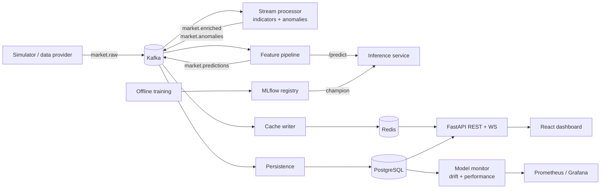

# Real-Time Stock Intelligence & Prediction Platform

An end-to-end, event-driven market-data platform: streaming ingestion through
Apache Kafka, incremental technical analytics, anomaly detection, an ML
lifecycle with experiment tracking, explicit model promotion and drift
monitoring, and a live React dashboard, all observable and runnable locally
with Docker Compose.

> **Not investment advice.** Model outputs are statistical estimates, labelled
> with model version, horizon and timestamp, and are kept visibly separate from
> market observations and deterministic analytics.

> **Project status: Phase 5 of 14 complete** (architecture, contracts,
> infrastructure, training dataset, market simulator, Kafka producer, stream
> processing with anomaly detection, storage sinks, the REST/WebSocket API, and historical data validation). See the [roadmap](docs/ROADMAP.md). This README is extended
> as each phase lands; sections for features that do not exist yet are marked
> *planned*.

<!-- Screenshots / GIF of the dashboard will be added in Phase 10. -->

## Architecture



Full diagrams, component responsibilities and design decisions:
[docs/ARCHITECTURE.md](docs/ARCHITECTURE.md).

## What is in place (Phases 1-5)

- **Versioned event contracts** (`shared/src/shared/schemas`): Pydantic v2
  models for bars, enriched bars, anomalies, predictions and dead letters.
  UTC-only timestamps, strict symbols, OHLC invariants, finite prices,
  deterministic prediction ids for idempotency, tolerant-reader evolution
  rules, and a `(event_type, schema_version)` registry.
- **Kafka topology as code** (`shared/src/shared/kafka`): topic specs
  (partitions, keys, retention), an idempotent provisioner that creates, grows
  and reconfigures topics, production-minded producer/consumer configs
  (idempotent producer, at-least-once consumer with manual offset storage,
  cooperative rebalancing), and a pluggable serde that classifies bad messages
  for the dead-letter topic.
- **Database schema + migrations** (`shared/src/shared/db`): 9 tables with
  idempotency keys, CHECK constraints mirroring the event invariants, and
  indexes chosen for the query patterns; Alembic migrations ship with the
  models and a test proves they never diverge.
- **Local infrastructure** (`docker-compose.yml`): Kafka 4 (KRaft), PostgreSQL
  16, Redis 7 (cache-only), MLflow 3 (Postgres backend, proxied artifacts),
  Prometheus, Grafana, optional Kafka UI; one-shot jobs for migrations and
  topic provisioning; health checks; localhost-only ports; secrets from `.env`.
- **Training dataset** (`ml/`): daily OHLCV for 12 US large caps, 2010-2026,
  from a CC0 dataset pinned to an exact commit, SHA-256-locked, stored as an
  immutable read-only snapshot, then validated and cleaned by 12 documented
  rules into a reproducible training input, with real extreme market events
  classified and kept rather than deleted ([details](docs/DATA_PIPELINE.md),
  [quality report](docs/DATA_QUALITY.md)).
- **Market producer** (`services/market-producer`): a GBM simulator
  calibrated per symbol from that history, with continuous OHLC paths,
  volume/volatility coupling and labelled price/volume anomalies; a historical
  replay mode; idempotent Kafka publishing with delivery accounting, bounded
  backpressure, Prometheus metrics and graceful shutdown
  ([details](docs/MARKET_PRODUCER.md)).
- **Stream processor** (`services/stream-processor`): incremental SMA, EMA,
  MACD, RSI, Bollinger Bands, volatility and volume indicators (checked
  against pandas), rule-based price/volume anomaly detection, explicit
  duplicate/late/gap policy, dead-letter routing, commit-after-ack
  at-least-once processing and state rebuilt by Kafka replay after restarts
  ([details](docs/STREAM_PROCESSING.md)).
- **Storage sinks + API** (`services/sinks`, `apps/api`): idempotent batched
  Postgres persistence and an event-time-guarded Redis cache (separate
  consumer groups); FastAPI with versioned REST endpoints, keyset pagination,
  graceful degradation when Redis or Postgres is down, structured errors,
  request ids, rate limiting, CORS, Prometheus metrics, and throttled
  WebSocket live updates fanned out through Redis pub/sub
  ([details](docs/API.md)).
- **Engineering baseline**: uv workspace + lockfile, ruff, mypy `--strict`,
  pytest with unit/integration split, pre-commit (incl. secret scanning),
  structured JSON logging with secret redaction, bounded retries with jitter.

## Technology choices

| Concern | Choice | Why |
| --- | --- | --- |
| Event backbone | Apache Kafka (KRaft), `confluent-kafka` | durable replayable log, per-key ordering, independent consumer groups ([ADR 0001](docs/adr/0001-kafka-as-event-backbone.md)) |
| Contracts | Pydantic v2, JSON on the wire | validation + evolution now, Schema Registry-ready ([ADR 0002](docs/adr/0002-json-events-first.md)) |
| System of record | PostgreSQL 16, SQLAlchemy 2, Alembic | relational history, joins for monitoring ([ADR 0003](docs/adr/0003-storage-by-access-pattern.md)) |
| Hot state | Redis | O(1) latest-value reads, pub/sub fan-out; never the source of truth |
| API | FastAPI, WebSockets, Redis pub/sub | async I/O, typed contracts, OpenAPI |
| ML (planned) | pandas, NumPy, scikit-learn, LightGBM/XGBoost, MLflow, Evidently-style drift metrics | tabular GBMs are the strong baseline for engineered features; MLflow for tracking + registry |
| Frontend (planned) | React + TypeScript (Vite SPA, not Next.js), Tailwind, TradingView Lightweight Charts | financial charting primitives, canvas performance |
| Observability | Prometheus, Grafana, structlog JSON logs | metrics + dashboards as code |
| Tooling | uv workspace, ruff, mypy strict, pytest, pre-commit, Docker, GitHub Actions (planned) | fast, reproducible, one lockfile ([ADR 0005](docs/adr/0005-monorepo-uv-workspace.md)) |

## Repository layout

```
.
├── services/
│   ├── market-producer/     # simulator + replay providers -> market.raw
│   ├── stream-processor/    # indicators + anomaly detection -> market.enriched / anomalies
│   └── sinks/               # Kafka -> Postgres (history) and Redis (latest state, pub/sub)
├── apps/
│   └── api/                 # FastAPI REST + WebSocket
├── ml/                      # stockml: dataset acquisition, calibration (later: features, training)
│   └── datasets/            # pinned dataset specs + checksum lock files
├── shared/                  # stockintel-shared: contracts used by every service
│   └── src/shared/
│       ├── schemas/         # versioned Kafka event models + registry
│       ├── kafka/           # topics, client configs, serde, provisioner
│       ├── db/              # SQLAlchemy models, engine, Alembic migrations
│       ├── observability/   # structured logging
│       └── utils/           # retry/backoff
├── infrastructure/
│   ├── docker/              # generic Python-service image + MLflow image
│   ├── postgres/init/       # first-boot SQL (MLflow DB/role)
│   ├── prometheus/          # scrape config
│   └── grafana/             # provisioned datasource + dashboards
├── tests/
│   ├── unit/                # no infrastructure needed
│   └── integration/         # against the running stack
├── docs/                    # architecture, Kafka design, data model, ADRs, roadmap
├── docker-compose.yml
├── Makefile
└── .env.example
```

Planned additions, each in the phase that implements it: `services/model-monitor`,
`apps/inference`, `apps/frontend`, `ml` features/training/evaluation,
`infrastructure/terraform`, `.github/workflows/`.

## Getting started

Prerequisites: Docker with Compose v2, GNU Make, and
[uv](https://docs.astral.sh/uv/) (it installs Python 3.12 automatically).

```bash
make env          # create .env from .env.example, then edit the passwords
make install      # Python deps + git hooks
make data         # download + verify the historical training dataset (~4.5 MB)
make data-quality # validate + clean it; writes data/processed and docs/DATA_QUALITY.md
make dev          # build images, start the stack, migrate DB, provision topics, start producer
make ps           # everything should be "healthy"
make tail-raw     # peek at live events on market.raw
make tail-anomalies   # detected anomalies as they happen
```

| Service | URL |
| --- | --- |
| Kafka (from host) | `localhost:9094` |
| PostgreSQL | `localhost:5432` |
| Redis | `localhost:6379` |
| MLflow | http://localhost:5000 |
| Prometheus | http://localhost:9090 |
| Grafana | http://localhost:3000 |
| API + OpenAPI docs | http://localhost:8000/docs |
| Producer metrics | http://localhost:8001/metrics |
| Kafka UI (`make kafka-ui`) | http://localhost:8081 |

### Quality checks

```bash
make check             # ruff + mypy --strict + unit tests (what CI runs on PRs)
make test-integration  # Kafka/Postgres integration tests (needs `make dev`)
make cov               # unit tests with coverage
make help              # all targets
```

## Documentation

- [Architecture](docs/ARCHITECTURE.md): components, diagrams, decisions
- [Kafka design](docs/KAFKA_DESIGN.md): topics, partitioning, delivery
  semantics, DLQ, backpressure, shutdown
- [Data model](docs/DATA_MODEL.md): storage responsibilities, ER diagram, indexes
- [Data pipeline](docs/DATA_PIPELINE.md): training dataset, provenance, acquisition, calibration
- [Market producer](docs/MARKET_PRODUCER.md): simulator model, anomalies, replay, delivery
- [Stream processing](docs/STREAM_PROCESSING.md): indicators, event-time policy, recovery, detector results
- [API and sinks](docs/API.md): endpoints, degradation, pagination, live updates, storage writes
- [Roadmap](docs/ROADMAP.md): phases, exit criteria, open questions
- [ADRs](docs/adr/): decision records

Planned: `ML_PIPELINE.md`, `PERFORMANCE.md` (with measured
results only), `DEPLOYMENT.md`.

## Known limitations (current)

- Single Kafka broker (replication factor 1) locally; production values are
  documented but not exercised here.
- No authentication yet; watchlists use an opaque `user_id`.
- No performance numbers are published until the Phase 12 benchmarks have
  produced them.
