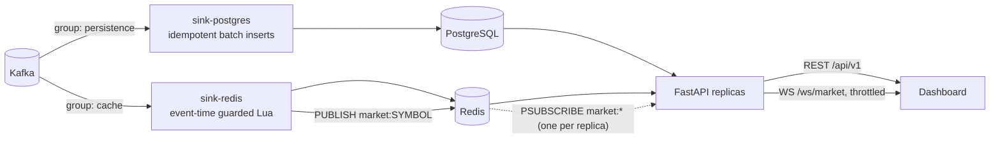

# API and Storage Sinks

Phase 4 adds the path from Kafka to the browser:



## 1. Sinks (`services/sinks`)

Two consumer groups share one batch runner and one image:

| Sink | Group | Topics | Writes |
| --- | --- | --- | --- |
| `sink-postgres` | `persistence` | raw, enriched, anomalies, predictions | `market_bars`, `bar_indicators`, `anomalies`, `predictions`, `symbols` |
| `sink-redis` | `cache` | enriched, anomalies, predictions | latest bar/prediction per symbol, recent anomalies, live pub/sub |

Separate groups mean a slow or restarting database never delays the live
dashboard, and either store can be rebuilt by resetting its group's offsets.

**Batch protocol.** Decode the batch (undecodable messages go to the DLQ),
write it with bounded jittered retries on transient errors, dead-letter any
events the store rejects permanently, and only then store the input offsets.
If storage stays down past the retry budget, the process exits without
committing and the batch is re-delivered after restart.

**PostgreSQL.** One transaction per batch, multi-row
`INSERT ... ON CONFLICT DO NOTHING ... RETURNING` (chunked at 1,000 rows),
so re-delivered events are no-ops and the sink reports written vs skipped
rows exactly (`rowcount` is unreliable for multi-row inserts, as a test
caught). If the database rejects a row the schema missed, the batch is
retried row by row in savepoints and only the offending rows are
dead-lettered. First-seen symbols are registered in `symbols`, and remembered
in memory only after the transaction commits.

**Redis.** Every write is a Lua script, so check-write-publish is atomic:

- `latest:bar:{symbol}` / `latest:prediction:{symbol}` only move forward in
  event time; stale or duplicate events are not written and **not
  published**. Predictions expire when their horizon passes.
- Recent anomalies are sorted-set members whose payload excludes
  `produced_at` (the only field that changes on reprocessing), so a
  re-delivered anomaly is the same member and is never re-announced. Sets are
  capped (500 global, 100 per symbol).
- A whole Kafka batch is one pipeline round trip.

## 2. REST API (`apps/api`)

OpenAPI docs: `http://localhost:8000/docs`. Layers: routers → `MarketService`
(use cases, degradation) → repositories (Postgres via async SQLAlchemy +
psycopg 3, Redis via `redis.asyncio`).

| Method | Path | Source |
| --- | --- | --- |
| GET | `/api/v1/stocks` | symbols (DB) ∪ active symbols (cache) + latest quote (cache) |
| GET | `/api/v1/stocks/{symbol}` | observation + analytics (cache), session stats (DB), prediction (cache) |
| GET | `/api/v1/stocks/{symbol}/history?interval&start&end&before&limit` | DB, keyset pagination |
| GET | `/api/v1/stocks/{symbol}/indicators?interval&before&limit` | DB |
| GET | `/api/v1/stocks/{symbol}/anomalies?before&limit` | cache (live), DB (paging) |
| GET | `/api/v1/stocks/{symbol}/predictions?before&limit` | DB |
| GET | `/api/v1/anomalies?before&limit` | global feed: cache, DB fallback |
| GET / POST / DELETE | `/api/v1/watchlist[/{symbol}]` | DB (user = `X-User-Id` header) |
| GET | `/health` | liveness, no dependencies |
| GET | `/ready` | `ready` / `degraded` (200) / `unavailable` (503) |
| GET | `/metrics` | Prometheus |

Routes are versioned (`/api/v1`) so a breaking change can ship as `/api/v2`
alongside the old one.

**Kinds of data stay separate.** `StockDetail` has distinct `observation`,
`analytics`, `session`, `prediction` and `freshness` fields. A prediction is
labelled `kind: "model_estimate"` with model name/version, horizon and a
disclaimer, and is `null` when no unexpired prediction exists.

**Pagination.** Keyset (`before=<timestamp>`), never `OFFSET`: pages stay
O(limit) however deep the history, and new rows arriving during paging do not
shift pages. Bar history is returned ascending within a page; `next_before`
is `null` when exhausted. A test pages through 30 bars in pages of 12 and
checks there are no gaps or overlaps.

**Graceful degradation.**

| Failure | Behaviour |
| --- | --- |
| Redis down | latest data served from Postgres (`freshness.source = "database"`); `/ready` = `degraded` |
| Postgres down | live endpoints keep working from Redis; history/watchlist answer 503; session stats omitted |
| Both down | 503 with a structured error; `/ready` = `unavailable` |
| No fresh prediction / ML down | `prediction: null`; analytics unaffected |

`freshness.stale` flags data older than 5 bar intervals (min 10 s), so the UI
can show when the stream has stopped instead of presenting old prices as live.

**Errors.** Always `{"error": {"code", "message", "request_id", "details"?}}`
(`not_found`, `validation_error`, `bad_request`, `rate_limited`,
`service_unavailable`, `internal_error`). Every response carries
`X-Request-ID` (accepted from the client or generated), which is also bound
into every log line of that request.

**Rate limiting.** Token bucket per client IP (default 20 req/s, burst 60),
429 with `Retry-After`; probes and metrics are exempt. It is in-process, so
with N replicas the effective limit is N× the configured rate; a global limit
would need a shared store (Redis) or the edge proxy/API gateway.

**CORS.** Explicit origin allow-list (`API_CORS_ORIGINS`), limited methods
and headers. Browsers do not apply CORS to WebSockets, so the WebSocket
handler checks `Origin` against the same list itself.

## 3. Live updates (`/ws/market`)

```
GET /ws/market?symbols=AAPL,MSFT      or      /ws/market/AAPL
```

| Direction | Message |
| --- | --- |
| server → client | `subscribed {symbols}`, `snapshot {items}` (current cached bars), `updates {server_time, items}`, `heartbeat`, `pong`, `error` |
| client → server | `{"action": "subscribe" \| "unsubscribe", "symbols": [...]}`, `{"action": "ping"}` |

Each `items` entry is `{"type": "bar" | "anomaly" | "prediction", "symbol", "data"}`.

**Fan-out.** Each API replica holds one Redis `PSUBSCRIBE market:*` and
routes messages to its local connections by symbol, so Redis sees one
subscriber per replica rather than one per browser tab, and any replica can
serve any client. The hub reconnects with backoff if Redis restarts.

**Throttling.** Per connection, bars and predictions are **coalesced**
(only the newest per symbol is kept until the next flush), anomalies are
queued (bounded at 100; overflow drops the oldest and is logged), and
everything pending is sent as one `updates` frame at most every 250 ms
(`API_WS_FLUSH_INTERVAL_MS`). A browser therefore receives at most ~4
frames/s regardless of the stream rate, the newest value is never lost, and a
slow client costs bounded memory without slowing anyone else. Idle
connections get a `heartbeat` every 15 s. Limits: 50 symbols per connection.

Tests check: coalescing (100 updates → 1 per symbol), bounded anomaly queue,
≤ 1 flush per interval with the newest value delivered, heartbeat when idle,
symbol routing, and, against real Redis, a burst of five bars delivered
coalesced (fewer than five updates) with the latest close preserved.

## 4. Metrics

| Metric | Meaning |
| --- | --- |
| `sip_sink_written_total{target}`, `sip_sink_skipped_total{target}` | rows/keys written vs skipped as duplicates/stale |
| `sip_sink_batch_write_seconds` | storage write time per batch (incl. retries) |
| `sip_sink_dead_lettered_total{reason}` | DLQ records |
| `sip_api_requests_total{method, route, status}` | route = template, e.g. `/api/v1/stocks/{symbol}` |
| `sip_api_request_duration_seconds{method, route}` | latency histogram |
| `sip_api_rate_limited_total` | 429s |
| `sip_api_websocket_connections` | open sockets |
| `sip_api_websocket_messages_total{type}`, `sip_api_websocket_coalesced_total` | frames sent; updates superseded by throttling |

## 5. Verification

- Unit (no infrastructure): service degradation rules with in-memory
  repositories, HTTP error shapes, request ids, rate limiting, CORS, OpenAPI
  routes, WebSocket throttling and hub routing.
- Integration against **real PostgreSQL 16 and Redis** (run in the build
  sandbox): both sinks (idempotency, row rejection, transient DB failure,
  event-time guard, anomaly de-duplication, prediction TTL), and the full API
  seeded through the sinks (listing, detail, pagination, anomalies,
  predictions, watchlist lifecycle, Redis outage falling back to Postgres,
  route-template metrics, live WebSocket updates, origin rejection).
- The Kafka side of the sinks is covered by the runner's unit tests; a
  Kafka round trip awaits a live broker (`make dev && make test-integration`).
