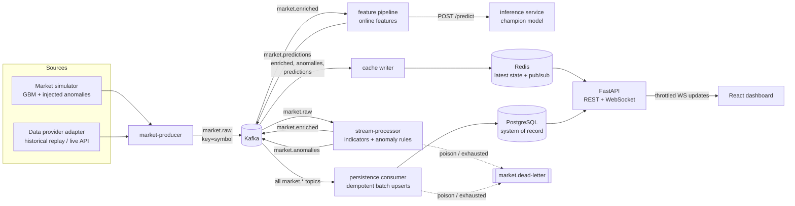
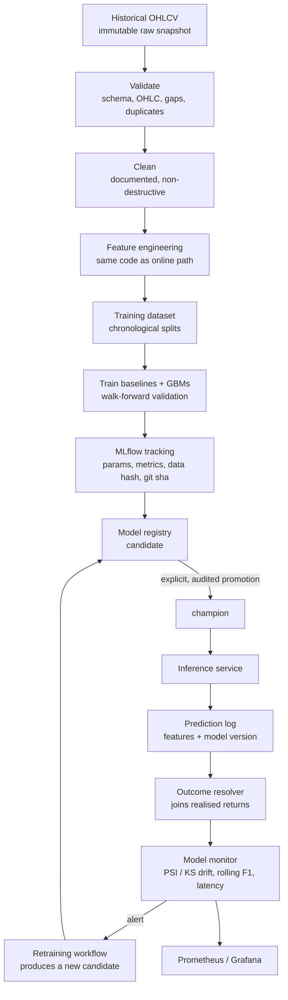
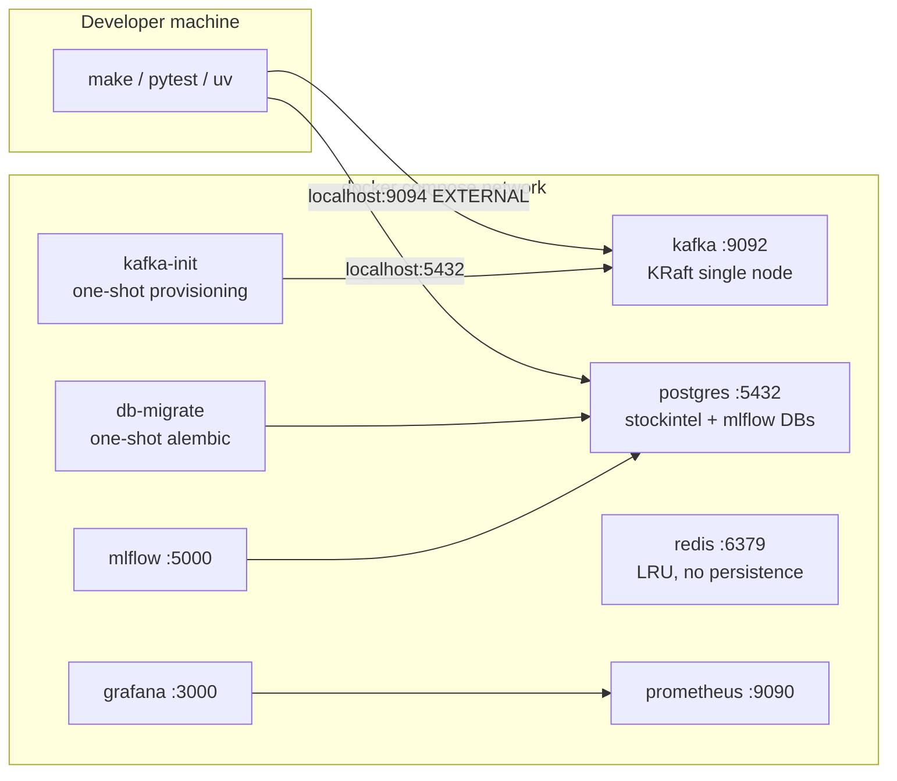

# Architecture

> Status: Phase 1 (foundations). Sections marked *planned* describe components
> that later phases build. This document is updated as each phase lands.

## 1. Goals and non-goals

**Goals**

- Ingest a continuous stream of OHLCV market events, process them through Kafka,
  and compute analytics, anomaly detections and ML predictions in near real time.
- Serve the latest state with low latency to a live React dashboard, and the
  full history from a durable store.
- Operate the ML lifecycle end to end: reproducible training, experiment tracking,
  explicit promotion, online inference, prediction logging, drift and
  performance monitoring, and a retraining path that never auto-deploys.
- Be observable, testable and runnable on one laptop with `make dev`.

**Non-goals**

- Real trading, order routing, or investment advice. Predictions are
  statistical estimates and are labelled as such everywhere.
- Tick-level, exchange-grade latency (microseconds). The design goal is
  sub-second end-to-end latency on local hardware; see `PERFORMANCE.md` (Phase 12)
  for measured numbers.
- Multi-tenant auth. Watchlists use an opaque `user_id` until auth is added.

## 2. System overview

Four kinds of information flow through the system and are **kept distinct in
topics, tables, API fields and UI**:

| Kind | Example | Produced by | Deterministic? |
| --- | --- | --- | --- |
| Raw observation | an OHLCV bar | simulator / data provider | n/a (input) |
| Analytics | SMA, RSI, MACD, Bollinger | stream processor | yes |
| Anomaly detection | "volume 6.2x its 20-bar mean" | stream processor | yes (statistical rules) or versioned model |
| ML prediction | "P(up over 5 bars) = 0.54, model v3" | inference service | no, a model estimate |

### Real-time path

### ML lifecycle

## 3. Components

| Component | Location | Responsibility | Scales by | Phase |
| --- | --- | --- | --- | --- |
| Shared contracts | `shared/` | Event schemas, topic topology, DB models + migrations, config, logging, retry | n/a (library) | 1 |
| Market producer | `services/market-producer/` | Simulator + provider adapters -> `market.raw` | one instance per symbol shard | 2 |
| Stream processor | `services/stream-processor/` | Incremental indicators, anomaly rules -> `market.enriched`, `market.anomalies` | consumer-group members (<= partitions) | 3 |
| Persistence consumer | `services/stream-processor/` (separate entry point) | Batched idempotent upserts into Postgres | consumer-group members | 4 |
| API | `apps/api/` | REST + WebSocket, reads Redis first, Postgres for history | stateless replicas behind LB | 4 |
| Offline data pipeline | `ml/data/` | Acquire -> validate -> clean historical data | batch job | 5 |
| Features | `ml/features/` | One feature library used offline *and* online | n/a (library) | 6 |
| Training / evaluation | `ml/training/`, `ml/evaluation/` | Baselines, GBMs, walk-forward CV, MLflow logging | batch job | 6-8 |
| Inference service | `apps/inference/` | Loads champion from registry, `POST /predict` | stateless replicas | 8 |
| Model monitor | `services/model-monitor/` | Outcome join, drift, performance, alerts, retrain trigger | single scheduled worker | 9 |
| Dashboard | `apps/frontend/` | React + TS + Tailwind, Lightweight Charts | static assets on CDN | 10 |
| Observability | `infrastructure/prometheus`, `infrastructure/grafana` | Metrics, dashboards, alerts | n/a | 1 (base), 11 |

## 4. Key decisions (summary)

Each decision has an ADR in [`docs/adr/`](adr/) with the alternatives considered.

| # | Decision | Why (short) |
| --- | --- | --- |
| [0001](adr/0001-kafka-as-event-backbone.md) | Kafka (KRaft) is the event backbone | Durable, replayable log; per-key ordering; independent consumer groups; the industry standard for market data fan-out |
| [0002](adr/0002-json-events-first.md) | JSON + Pydantic now, Schema Registry-ready | Debuggable, zero extra infra; versioned envelope and a serde protocol keep the Avro/Protobuf door open |
| [0003](adr/0003-storage-by-access-pattern.md) | Postgres = history, Redis = hot state, Kafka = transport | Each store used for the access pattern it is good at; Redis is never the source of truth |
| [0004](adr/0004-at-least-once-with-idempotent-sinks.md) | At-least-once + idempotent sinks, no "exactly-once" claims | Simple, robust, honest; duplicates are neutralised by keys, not by hope |
| [0005](adr/0005-monorepo-uv-workspace.md) | Monorepo, uv workspace, one `shared` contract package | Contracts change atomically with their consumers; per-service images stay small |
| [0006](adr/0006-explicit-audited-promotion.md) | Explicit, audited promotion via MLflow aliases and gates | No model reaches users without a person, a reason and a record; quality-gate overrides are visible |

Further decisions recorded here (short enough not to need an ADR):

- **Partition key = symbol.** Per-symbol ordering is what rolling indicators
  need; there is no cross-symbol ordering requirement. Hot-symbol skew is the
  known cost, discussed in `KAFKA_DESIGN.md`.
- **Bar semantics.** `timestamp` is the bar *open* time (event time) in UTC;
  a bar covers `[timestamp, timestamp + interval)` and is published only once
  closed. Partial/in-progress bars are out of scope for v1.
- **React + TypeScript on Vite, not Next.js.** The dashboard is a
  client-side, real-time view behind authentication-free local APIs: no SEO,
  no server-rendered pages, no need for a Node server between the browser and
  FastAPI. A Vite SPA builds to static files served from a CDN or nginx, and
  keeps the backend boundary simple (REST + WebSocket to FastAPI only).
  Next.js would earn its place if public, SEO-relevant pages were added.
- **WebSocket over SSE** for the dashboard: the client changes its symbol
  subscriptions at runtime, which fits a bidirectional channel. The server
  throttles to a bounded update rate per connection and fans out across API
  replicas through Redis pub/sub (Phase 4).
- **Charting: TradingView Lightweight Charts.** Purpose-built for
  candlesticks + volume + overlays, canvas-rendered (handles thousands of bars),
  small bundle, Apache-2.0 (attribution required). Recharts/ECharts would need more
  work for financial interactions.
- **Plain PostgreSQL 16, not TimescaleDB (yet).** At local scale, a composite
  primary key `(symbol, bar_interval, ts)` plus a BRIN index on `ts` is enough.
  TimescaleDB becomes worthwhile when `market_bars` reaches hundreds of millions
  of rows, where hypertable chunking, native compression and continuous
  aggregates (e.g. 1m -> 1h rollups) pay for the extra dependency. The schema is
  compatible with `create_hypertable` on `ts`.
- **Floats for prices.** This is an analytics platform; NumPy/pandas/the model
  all operate in float64. A ledger would use `NUMERIC`/`Decimal`.

## 5. Cross-cutting concerns

**Time.** Every timestamp is timezone-aware UTC; naive datetimes are rejected
at the schema boundary. Event time (`timestamp`) drives analytics; processing
time (`produced_at`) drives latency metrics. Out-of-order and late events are
handled in the stream processor (Phase 3) with per-symbol monotonic watermarks:
duplicate or older-than-last bars are dropped from indicator state (counted in
a metric) but still persisted, because persistence is keyed by event time.

**Failure handling.** Bounded exponential backoff with full jitter
(`shared.utils.retry`) for transient dependency failures; dead-letter topic
for poison messages; readiness probes that reflect dependency health; graceful
degradation (the dashboard keeps deterministic analytics when inference is
down; predictions carry timestamps so the UI can mark them stale).

**Observability.** JSON logs with `service`, `event_id`, `symbol`,
`trace_id`; secret-looking keys are redacted by a logging processor. Every
service exposes Prometheus metrics (Phase 2+); librdkafka statistics are
enabled for client-side lag/throughput metrics.

**Security.** Secrets only via environment (`.env`, never committed), host
ports bound to `127.0.0.1`, non-root containers for our images, strict input
validation at every boundary, CORS allow-list and rate limiting at the API
(Phase 4), dependency and secret scanning in CI (Phase 13).

## 6. Local runtime topology (Phase 1)

## 7. Scalability outline

Detailed in `KAFKA_DESIGN.md` now and in a dedicated scalability section in
Phase 12, after measurements exist. In short: producers and consumers scale
horizontally up to the partition count; the API and inference service are
stateless; Postgres is protected by batching, connection pooling and indexes;
Redis absorbs read fan-out. No throughput figure is claimed until the
benchmark in Phase 12 has measured it.
