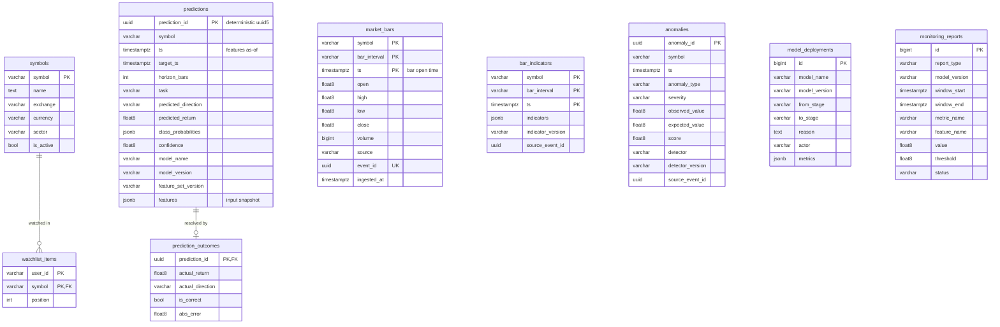

# Data Model and Storage

Storage is chosen by access pattern ([ADR 0003](adr/0003-storage-by-access-pattern.md)):

| Store | Holds | Access pattern | Durability |
| --- | --- | --- | --- |
| **Kafka** | every event, in order | append + sequential replay | days (retention per topic) |
| **PostgreSQL** | history and records: bars, indicators, anomalies, predictions, outcomes, model promotions, monitoring results, watchlists | range scans by symbol and time, joins, ad-hoc analysis | system of record |
| **Redis** | latest price/indicators/prediction per symbol, recent anomaly list, pub/sub fan-out to API replicas | O(1) key reads, very high read rate | none (cache; rebuilt from Kafka/Postgres) |
| **MLflow** (own Postgres DB + artifact store) | runs, params, metrics, model artifacts, registry | written by training, read by inference | durable |
| **Files (Parquet)** | offline datasets: raw -> validated -> cleaned -> features | batch, columnar | immutable raw; the rest reproducible (Phase 5) |

The schema is defined once as SQLAlchemy models in
[`shared/src/shared/db/models.py`](../shared/src/shared/db/models.py) and
versioned with Alembic migrations that ship in the same package. An
integration test asserts the migration head and the models never diverge.

## Entity-relationship diagram

## Table notes

**`market_bars`**: append-only raw observations, the historical source of
truth.
- PK `(symbol, bar_interval, ts)` is both the natural idempotency key and the
  index for the dominant query "bars for AAPL/1m between t1 and t2, newest
  first" (a backward index scan).
- `event_id` is unique too, so a redelivered event is a no-op even if a
  provider were to re-emit a corrected bar with a new timestamp.
- **BRIN index on `ts`** for cross-symbol time-range scans (retention,
  "everything since X"). Rows arrive roughly in time order, which is
  exactly when BRIN is orders of magnitude smaller than an equivalent B-tree.
- CHECK constraints repeat the event-schema invariants (positive prices, OHLC
  consistency, non-negative volume, known interval). The schema is the first
  line of defence; the database is the last, and protects against any future
  writer that bypasses the models.
- No FK to `symbols`: ingestion must not fail because reference data lags.

**`bar_indicators`**: one JSONB document per bar. The indicator set changes
as the project evolves; JSONB avoids a migration per new indicator while
`indicator_version` records how values were computed. A key graduates to a
real column when it is filtered or aggregated on in SQL.

**`anomalies`**: indexed by `(symbol, ts DESC)` for a symbol's anomaly
history and by `ts DESC` for the global live feed. Unique
`(source_event_id, detector, anomaly_type)` makes redelivery idempotent.

**`predictions` / `prediction_outcomes`**: every served prediction is stored
with its model version, feature-set version and the input feature snapshot,
which the monitor uses for drift detection without recomputing features.
Outcomes are written by the resolver once `target_ts` has passed (the
`ix_predictions_target_ts` index drives that job). Keeping outcomes in their
own table keeps `predictions` insert-only.

**`model_deployments`**: an audit log of stage transitions
(`candidate -> challenger -> champion -> archived`). MLflow stores artifacts
and registry aliases; this table records *who* promoted *what* and *why*,
with the evaluation metrics that justified it.

**`monitoring_reports`**: long format (one row per metric/feature/window),
which suits both the dashboard ("PSI per feature over time") and alert rules.

**`watchlist_items`**: FK to `symbols` because this is user input and must
refer to a real instrument.

## Conventions

- `timestamptz` everywhere, stored and returned as UTC.
- Enumerations are `varchar` + `CHECK (... IN (...))` generated from the same
  Python enums the event schemas use. Native PG enums were avoided because
  `ALTER TYPE ... ADD VALUE` cannot be rolled back inside a transaction.
- Deterministic constraint names via a SQLAlchemy naming convention, so
  migrations are reproducible and reviewable.
- Column is `bar_interval`, not `interval` (a SQL keyword).

## Retention and growth

At a simulated 10 symbols x 1 bar/second, `market_bars` grows by ~864k
rows/day. Locally that is fine for weeks. The planned mitigations, in order of
need: a retention job deleting raw 1s bars older than N days (after rollup),
monthly declarative partitioning by `ts` (cheap drops instead of deletes),
then TimescaleDB hypertables + compression + continuous aggregates.

## Redis key design (Phase 4)

| Key | Type | Content | TTL |
| --- | --- | --- | --- |
| `latest:bar:{symbol}` | hash | last bar + indicators | none (overwritten), guarded by event time |
| `latest:prediction:{symbol}` | hash | last prediction + model version + `predicted_at` | horizon-based, so stale predictions expire |
| `anomalies:recent` | capped list / stream | last N anomalies | trimmed on write |
| `channel:market:{symbol}` | pub/sub | throttled updates for WebSocket fan-out | n/a |

Redis runs with `maxmemory` + `allkeys-lru` and no persistence: losing it costs
a cache warm-up, never data.
