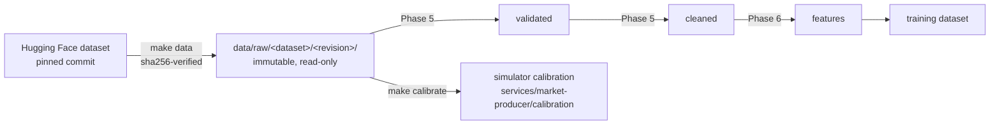

# Historical Data Pipeline

Status: **acquisition and simulator calibration are implemented** (Phase 2).
Validation, cleaning and feature stages follow in Phases 5-6.

## 1. Default dataset: `us-equities-daily`

| Property | Value |
| --- | --- |
| Source | Hugging Face dataset [`AYUSHKHAIRE/all-stock-market-data-daily-updates`](https://huggingface.co/datasets/AYUSHKHAIRE/all-stock-market-data-daily-updates) |
| Pinned revision | `5ee174781f6592de213df233339fcacb118dc492` (upload of 2026-09-27) |
| Declared licence | CC0-1.0 (public-domain dedication by the uploader) |
| Symbols | AAPL, MSFT, GOOGL, AMZN, NVDA, META, JPM, XOM, JNJ, WMT, PG, TSLA (12 large caps, 7 sectors, low to high volatility) |
| Frequency | daily (one bar per regular trading session) |
| Date range | 2010-01-04 to 2026-09-25; META from 2012-05-18 (IPO), TSLA from 2010-06-29 (IPO) |
| Rows | 4,208 per symbol with full history (META 3,609, TSLA 4,086); 49,775 total |
| Fields | `open, high, low, close, volume, timestamp` (epoch seconds) |
| Size | ~4.5 MB (12 CSV files) |

The spec lives in [`ml/datasets/us-equities-daily.toml`](../ml/datasets/us-equities-daily.toml);
per-file SHA-256 checksums in the committed
[`us-equities-daily.lock.json`](../ml/datasets/us-equities-daily.lock.json).

### Why this dataset

| Option | Verdict |
| --- | --- |
| **HF `all-stock-market-data-daily-updates`** | **chosen**: free, no account or API key, explicit CC0 licence, downloadable at an exact commit (reproducible), long daily history for US large caps |
| Yahoo Finance (`yfinance`) | unofficial API, rate limited, terms restrict redistribution/automated use; not reproducible (data served "as of now") |
| Stooq CSV | now behind a JavaScript browser challenge; automating around it would circumvent an access control, so rejected |
| Kaggle datasets | require an account + API token; fine as an optional provider, not as the default |
| Alpha Vantage / Polygon / Finnhub | require keys, rate limited; kept as future live-provider adapters |

### Provenance caveat

The uploader dedicates the files to the public domain but does not document
where the prices come from; the float32-looking values (e.g.
`7.585000038146973`) and split handling are consistent with Yahoo-sourced
data. The dataset is used here for **local research and education**, the
files are **not redistributed** (they are downloaded by each user and
git-ignored), and any production use would require a licensed data vendor.

### Observed characteristics (profiled on the pinned snapshot)

Measured with pandas over all 12 files; re-checked formally by the Phase 5
validation stage.

- **No** missing values, duplicate timestamps, non-positive prices,
  zero-volume days, or OHLC violations (`high >= max(open, close, low)`,
  `low <= min(open, close)`).
- **Split-adjusted**: e.g. NVDA's 10:1 split (2024-06-10) shows no price
  discontinuity and volume is scaled accordingly. Whether prices are also
  dividend-adjusted is not documented; returns therefore may exclude
  dividends (a small, known bias for high-yield names such as XOM, PG, JNJ).
- **Timestamps** are the session open in UTC, 14:30 (EST) or 13:30 (EDT):
  daylight saving time shows up as a one-hour shift, which is why features
  must use the *trading date*, not the raw clock time.
- **Calendar**: ~252 rows per year; the only gap longer than a long weekend is
  2012-10-29/30 (NYSE closed for Hurricane Sandy), which is legitimate and
  must not be "repaired".
- **Extreme moves are real**: the largest absolute daily returns are 29-30%
  (NVDA, META) and 24% (TSLA). They are market events, not errors, and are
  kept (see the cleaning policy in Phase 5).
- **Heterogeneous files**: column *order* differs between files, so readers
  select columns by header name.

## 2. Acquisition (`make data`)

`python -m stockml.data.acquire` ([source](../ml/src/stockml/data/acquire.py)):

1. Load the spec; refuse branch names: the revision must be a 40-char commit
   sha, because the upstream repository is re-uploaded daily.
2. For each symbol, download
   `https://huggingface.co/datasets/<repo>/resolve/<sha>/<shard>/<SYMBOL>.csv`
   with bounded, jittered retries on timeouts/429/5xx.
3. Verify the SHA-256 against the lock file. **A mismatch aborts before
   anything is written.**
4. Write atomically (temp file + rename) into
   `data/raw/us-equities-daily/<sha>/`, mark files read-only, and write a
   `_manifest.json` (source, revision, licence, checksums, acquisition time).
5. Re-running skips files already present with the right checksum; a
   corrupted local file is replaced.

Moving to a newer snapshot is deliberate: bump `revision`, run
`make data-update-lock`, review the lock diff, commit. The old snapshot
directory stays untouched, so earlier experiments remain reproducible.

## 3. Simulator calibration (`make calibrate`)

`python -m stockml.data.calibrate` estimates per-symbol parameters from the
last 756 trading days (3 years) and writes
[`services/market-producer/calibration/us-equities-daily.json`](../services/market-producer/calibration/us-equities-daily.json):
starting price, annualised volatility and drift of daily log returns, median
daily volume and log-volume dispersion. The simulator reads this small,
committed file, so the producer does not depend on pandas or on the raw data.

Drift estimated from three years of data is dominated by noise (standard
error of roughly sigma/sqrt(3), i.e. about 15 percentage points for a 26%-vol
stock), so the simulator lets it be overridden, and defaults to zero drift for
intraday simulation where it is irrelevant anyway.

## 4. Planned stages

- **Validation (Phase 5)**: schema and dtype checks, duplicate/missing
  timestamps against the exchange calendar, OHLC and positivity constraints,
  volume sanity, extreme-return flagging with market-wide cross-checks, a
  machine-readable data-quality report.
- **Cleaning (Phase 5)**: every rule documented; erroneous observations
  (e.g. OHLC violations, zero prices) are removed or repaired with a reason
  code, while legitimate extreme market events are kept and flagged.
- **Features and splits (Phase 6)**: point-in-time features shared with the
  online path, chronological splits with an embargo equal to the label horizon.
