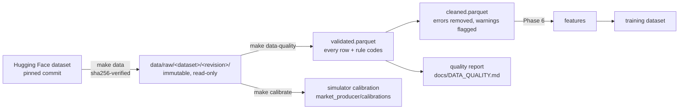

# Historical Data Pipeline

Status: acquisition and calibration (Phase 2) and **validation + cleaning
(Phase 5)** are implemented; the feature stage follows in Phase 6.

## 1. Default dataset: `us-equities-daily`

| Property | Value |
| --- | --- |
| Source | Hugging Face dataset [`AYUSHKHAIRE/all-stock-market-data-daily-updates`](https://huggingface.co/datasets/AYUSHKHAIRE/all-stock-market-data-daily-updates) |
| Pinned revision | `5ee174781f6592de213df233339fcacb118dc492` (upload of 2026-09-27) |
| Declared licence | CC0-1.0 (public-domain dedication by the uploader) |
| Symbols | AAPL, MSFT, GOOGL, AMZN, NVDA, META, JPM, XOM, JNJ, WMT, PG, TSLA (12 large caps, 7 sectors, low to high volatility) |
| Frequency | daily (one bar per regular trading session) |
| Date range | 2010-01-04 to 2026-09-25; META from 2012-05-18 (IPO), TSLA from 2010-06-29 (IPO) |
| Rows | 4,208 per symbol with full history (META 3,609, TSLA 4,086); 49,775 total |
| Fields | `open, high, low, close, volume, timestamp` (epoch seconds) |
| Size | ~4.5 MB (12 CSV files) |

The spec lives in [`ml/datasets/us-equities-daily.toml`](../ml/datasets/us-equities-daily.toml);
per-file SHA-256 checksums in the committed
[`us-equities-daily.lock.json`](../ml/datasets/us-equities-daily.lock.json).

### Why this dataset

| Option | Verdict |
| --- | --- |
| **HF `all-stock-market-data-daily-updates`** | **chosen**: free, no account or API key, explicit CC0 licence, downloadable at an exact commit (reproducible), long daily history for US large caps |
| Yahoo Finance (`yfinance`) | unofficial API, rate limited, terms restrict redistribution/automated use; not reproducible (data served "as of now") |
| Stooq CSV | now behind a JavaScript browser challenge; automating around it would circumvent an access control, so rejected |
| Kaggle datasets | require an account + API token; fine as an optional provider, not as the default |
| Alpha Vantage / Polygon / Finnhub | require keys, rate limited; kept as future live-provider adapters |

### Provenance caveat

The uploader dedicates the files to the public domain but does not document
where the prices come from; the float32-looking values (e.g.
`7.585000038146973`) and split handling are consistent with Yahoo-sourced
data. The dataset is used here for **local research and education**, the
files are **not redistributed** (they are downloaded by each user and
git-ignored), and any production use would require a licensed data vendor.

### Observed characteristics (profiled on the pinned snapshot)

Measured with pandas over all 12 files; re-checked formally by the Phase 5
validation stage.

- **No** missing values, duplicate timestamps, non-positive prices,
  zero-volume days, or OHLC violations (`high >= max(open, close, low)`,
  `low <= min(open, close)`).
- **Split-adjusted**: e.g. NVDA's 10:1 split (2024-06-10) shows no price
  discontinuity and volume is scaled accordingly. Whether prices are also
  dividend-adjusted is not documented; returns therefore may exclude
  dividends (a small, known bias for high-yield names such as XOM, PG, JNJ).
- **Timestamps** are the session open in UTC, 14:30 (EST) or 13:30 (EDT):
  daylight saving time shows up as a one-hour shift, which is why features
  must use the *trading date*, not the raw clock time.
- **Calendar**: ~252 rows per year; the only gap longer than a long weekend is
  2012-10-29/30 (NYSE closed for Hurricane Sandy), which is legitimate and
  must not be "repaired".
- **Extreme moves are real**: the largest absolute daily returns are 29-30%
  (NVDA, META) and 24% (TSLA). They are market events, not errors, and are
  kept (see the cleaning policy in Phase 5).
- **Heterogeneous files**: column *order* differs between files, so readers
  select columns by header name.

## 2. Acquisition (`make data`)

`python -m stockml.data.acquire` ([source](../ml/src/stockml/data/acquire.py)):

1. Load the spec; refuse branch names: the revision must be a 40-char commit
   sha, because the upstream repository is re-uploaded daily.
2. For each symbol, download
   `https://huggingface.co/datasets/<repo>/resolve/<sha>/<shard>/<SYMBOL>.csv`
   with bounded, jittered retries on timeouts/429/5xx.
3. Verify the SHA-256 against the lock file. **A mismatch aborts before
   anything is written.**
4. Write atomically (temp file + rename) into
   `data/raw/us-equities-daily/<sha>/`, mark files read-only, and write a
   `_manifest.json` (source, revision, licence, checksums, acquisition time).
5. Re-running skips files already present with the right checksum; a
   corrupted local file is replaced.

Moving to a newer snapshot is deliberate: bump `revision`, run
`make data-update-lock`, review the lock diff, commit. The old snapshot
directory stays untouched, so earlier experiments remain reproducible.

## 3. Simulator calibration (`make calibrate`)

`python -m stockml.data.calibrate` estimates per-symbol parameters from the
last 756 trading days (3 years) and writes
[`market_producer/calibrations/us-equities-daily.json`](../services/market-producer/src/market_producer/calibrations/us-equities-daily.json):
starting price, annualised volatility and drift of daily log returns, median
daily volume and log-volume dispersion. The simulator reads this small,
committed file, so the producer does not depend on pandas or on the raw data.

Drift estimated from three years of data is dominated by noise (standard
error of roughly sigma/sqrt(3), i.e. about 15 percentage points for a 26%-vol
stock), so the simulator lets it be overridden, and defaults to zero drift for
intraday simulation where it is irrelevant anyway.

## 4. Validation and cleaning (`make data-quality`)

`python -m stockml.data.pipeline` ([quality](../ml/src/stockml/data/quality.py),
[cleaning](../ml/src/stockml/data/cleaning.py),
[pipeline](../ml/src/stockml/data/pipeline.py)) re-verifies the raw files
against the lock file, then writes to `data/processed/<dataset>/<revision>/`:

| Output | Content |
| --- | --- |
| `validated.parquet` | every raw row: raw strings, parsed values, rule codes |
| `cleaned.parquet` | the canonical training input |
| `removed_rows.csv` | audit log: symbol, file line, rule codes, reason, raw values |
| `quality_report.json` | machine-readable report, rendered to [`DATA_QUALITY.md`](DATA_QUALITY.md) |
| `manifest.json` | input checksums, revision, config, pipeline version, output hashes |

Raw files are read **as strings**, so a malformed value reaches the
validator as a finding instead of crashing the parser.

### Rules

**Errors** cannot be true or cannot be used, and are removed (the reason is
logged per row):

| Code | Rule | Action |
| --- | --- | --- |
| E001 | missing / non-numeric price or volume | drop row |
| E002 | timestamp missing, unparsable, before 1990 or in the future | drop row |
| E003 | non-positive price | drop row |
| E004 | negative volume | drop row |
| E005 | OHLC inconsistent (`high < max(open, close, low)` or `low > min(open, close)`) | drop row |
| E006 | several rows for one timestamp that disagree | drop **all** copies (no basis to pick one) |
| E007 | exact repeat of an earlier row | keep the first |

**Warnings** are unusual but may be real, and are kept and flagged:

| Code | Rule | Flag in `cleaned.parquet` |
| --- | --- | --- |
| W101 | extreme move | `extreme_class` |
| W102 | zero volume in a session | `flag_zero_volume` |
| W103 | sessions missing before this row | `missing_sessions_before` |
| W104 | bar does not open at 09:30 New York time | `flag_irregular_time` |
| W105 | close unchanged ≥ 5 sessions | `flag_stale_price` |

### Erroneous data vs real extreme events

A crash day is not a data error, and deleting it would teach a model that
crashes do not happen. So extreme moves are **classified, not removed**:

1. **Detect**: robust z-score of the log return against the symbol's
   *trailing* 252-day median and MAD (prior returns only, ≥ 60 required):
   `|z| ≥ 6`. MAD rather than standard deviation, so earlier spikes do not
   inflate the yardstick.
2. **Classify** (first match wins):
   - `market_wide`: at least half the symbols moved `|z| ≥ 3` that day
     (e.g. 2011-08-08, March 2020) → real
   - `volume_confirmed`: volume ≥ 2× the trailing 50-day median → real
     (earnings, news)
   - `suspect_reversal`: fully reversed the next session (≥ 80%) on
     normal volume → the classic signature of a bad print
   - `idiosyncratic`: none of the above → kept, worth a look

`suspect_reversal` rows are kept by default too (`--drop-suspect-reversals`
removes them for experiments): a reversal can be real, and the cost of
silently deleting a real event is higher than flagging a bad one. The
classification uses the *next* day, so these flags are **quality
annotations, never model features** (that would leak the future).

### Calendar, gaps and time zones

There is no exchange-calendar dependency: the trading calendar is inferred as
the **consensus** of the data (a date is a session if at least half of the
symbols listed on that date have a bar). Market-wide closures (holidays,
Hurricane Sandy) are therefore not gaps, while one symbol missing a day that
others traded is. Gaps are **not imputed** (inventing prices invents
returns); their length is recorded in `missing_sessions_before` so the
feature stage can avoid computing returns across them.

Session times are checked in New York time, so the daylight-saving shift
between 14:30 and 13:30 UTC is correctly not flagged (tested across a DST
switch).

### Results on the pinned snapshot

From [`DATA_QUALITY.md`](DATA_QUALITY.md) (generated by `make data-quality`):

- 49,775 raw rows, **0 removed**, 49,775 cleaned; the consensus calendar has
  4,208 sessions and no symbol has missing sessions.
- 239 extreme moves flagged and kept: 104 `market_wide` (e.g. August 2011,
  March 2020), 122 `volume_confirmed`, 13 `idiosyncratic`,
  0 `suspect_reversal`.
- No zero-volume days, stale prices or irregular session times.

This snapshot is clean, so every rule is exercised by unit tests on
deliberately corrupted files (one test per error rule, duplicates, gaps vs
market closures, each extreme-move class, DST).

**Reproducibility**: the same snapshot, config and pipeline version produce a
byte-identical `cleaned.parquet` (its SHA-256 is in the manifest; a test
re-runs the pipeline and compares). If a raw file no longer matches the lock
file, the pipeline refuses to run.

## 5. Next: features and splits (Phase 6)

Point-in-time features shared with the online path, computed from
`cleaned.parquet` without crossing recorded gaps, and chronological splits
with an embargo equal to the label horizon.
