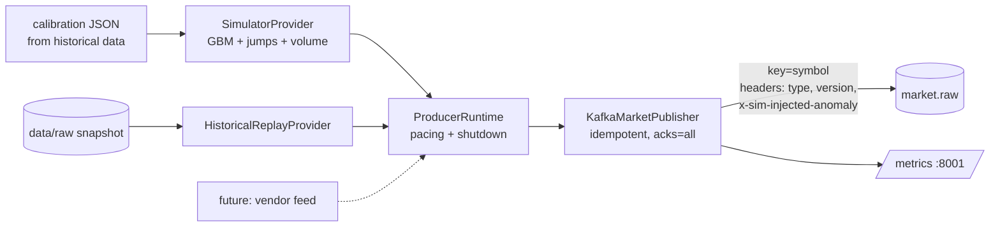

# Market Producer

`services/market-producer` turns a **market data provider** into validated
`market.bar` events on `market.raw`. Two providers exist: a calibrated
stochastic **simulator** (default; no credentials, deterministic) and a
**historical replay** of the pinned dataset. Live vendor feeds plug into the
same interface.



## 1. Provider abstraction

```python
class MarketDataProvider(Protocol):
    name: str

    def batches(self) -> Iterator[Batch]: ...  # Batch(due_at: epoch seconds, bars: [ProducedBar])
```

A provider only decides *what* to publish and *when it is due*. Pacing,
Kafka, metrics and shutdown live in the runtime, so a new source is one class
and no pipeline change.

## 2. Simulator

### Price model

Geometric Brownian motion per symbol, simulated on 10 sub-steps inside each
bar so that high and low are the extremes of an actual path:

$$\ln S_{t+h} = \ln S_t + \left(\mu - \tfrac{1}{2}\sigma^2\right)h + \sigma\sqrt{h}\,Z,\qquad Z\sim\mathcal N(0,1)$$

- `h` is measured in **trading time** (252 sessions x 6.5 h), and a bar never
  spans more than one session (a `1d` bar is one session, `h = 1/252`; before
  Phase 9 it wrongly received 24 h of variance, see
  [MONITORING.md](MONITORING.md#end-to-end-check-on-simulated-data)), consistent with
  how the calibration annualises daily data.
- **Continuity**: every bar opens at the previous close; prices are rounded to
  cents (rounding is monotonic, so OHLC ordering is preserved).
- **Calibration** (`make calibrate`): starting price, sigma and volume come
  from the last three years of each symbol's history. Drift defaults to 0
  because a 3-year drift estimate is mostly noise and irrelevant intraday
  (`PRODUCER_USE_CALIBRATED_DRIFT=true` to use it).
- **Determinism**: each symbol's RNG is seeded with `(seed, crc32(symbol))`,
  so a symbol's path depends only on the seed, never on which other symbols
  are simulated.

What GBM deliberately does **not** model: volatility clustering, fat tails
beyond the injected jumps, intraday seasonality, cross-asset correlation,
market hours. It is a controlled test signal, not a market replica, and by
construction its returns are unpredictable, which matters for how the ML
demo is interpreted (see `ROADMAP.md`).

### Volume model

Log-normal around the calibrated median daily volume scaled to the bar
length (`median x interval / 6.5 h`), multiplied by
`1 + 0.3 * min(|z|, 10)` where `z` is the bar's return in units of its own
sigma: bigger moves trade more, as in real markets.

### Injected anomalies (ground truth)

| Type | Mechanism | Default probability per bar & symbol |
| --- | --- | --- |
| `price_spike` / `price_drop` | log-price jump of `U(2%, 5%)` at a random sub-step; persists as a level shift (Merton-style jump); volume x `U(2, 4)` | 0.001 (jumps) |
| `volume_spike` | volume x `U(5, 15)`, no price effect | 0.002 |

At the default 1-second bars and 12 symbols that is roughly one price jump
every 80 seconds and one volume spike every 40 seconds across the universe.

Labels travel in the Kafka header **`x-sim-injected-anomaly`** (e.g.
`price_spike,volume_spike`) and in the `sip_producer_injected_anomalies_total`
metric. They are never part of the event payload: a real feed cannot know
them, and detectors must not be able to peek. Phase 3 uses the header to
measure detector precision and recall.

### Time and pacing

Bars are aligned to the interval grid and published when they **close**.
On start, `PRODUCER_BACKFILL_BARS` already-closed bars are published at once
(chart history), then the stream continues in real time. Event times are
therefore never in the future. High-rate load generation for benchmarks is a
separate tool (Phase 12), not a "speed-up" of event time.

## 3. Historical replay

`PRODUCER_MODE=replay` with `PRODUCER_REPLAY_SNAPSHOT_DIR=data/raw/us-equities-daily/<sha>`
streams the real daily bars (original timestamps, `interval=1d`,
`source=replay:<dataset>`), all symbols merged in time order with a k-way
merge (memory O(symbols)). Rows that fail the event schema, and non-increasing
timestamps, are skipped and counted; invalid data is never published.
`PRODUCER_REPLAY_BARS_PER_SECOND` controls the pace.

## 4. Publishing and delivery

- Key = symbol (per-symbol ordering), value = JSON event, headers =
  `event_type`, `schema_version`, `content-type`, optional
  `x-sim-injected-anomaly`.
- Idempotent producer with `acks=all`; success is counted only in the
  **delivery report**, never at enqueue time.
- **Backpressure**: when librdkafka's local queue is full (`BufferError`) the
  publisher serves delivery reports and retries, for at most 30 s, then fails
  the process (`QueueFullError`, exit 1) rather than buffering without bound.
- **Broker down**: the client keeps retrying inside `delivery.timeout.ms`
  (120 s); failures surface as delivery-failure metrics and error logs with
  the `event_id`.
- **Graceful shutdown**: SIGTERM/SIGINT set a stop event that also interrupts
  waiting between bars; the runtime then flushes and logs how many events were
  delivered, failed, and still undelivered. Compose gives it
  `stop_grace_period: 20s`. The exit code is non-zero if anything was lost.

## 5. Configuration

All settings are environment variables (see `.env.example`):

| Variable | Default | Meaning |
| --- | --- | --- |
| `PRODUCER_MODE` | `simulator` | `simulator` or `replay` |
| `PRODUCER_SYMBOLS` | *(empty)* | comma-separated tickers; empty = the 12 calibrated symbols |
| `PRODUCER_NUM_SYMBOLS` | *(unset)* | first N calibrated symbols, topped up with synthetic `SIM001`... |
| `PRODUCER_INTERVAL` | `1s` | bar length (update frequency) |
| `PRODUCER_BACKFILL_BARS` | `300` | closed bars published on start |
| `PRODUCER_SEED` | `42` | RNG seed |
| `PRODUCER_VOLATILITY_MULTIPLIER` | `1.0` | scales sigma |
| `PRODUCER_DRIFT_ANNUAL` / `PRODUCER_USE_CALIBRATED_DRIFT` | `0.0` / `false` | trend |
| `PRODUCER_PRICE_JUMP_PROBABILITY`, `PRODUCER_JUMP_MIN`, `PRODUCER_JUMP_MAX` | `0.001`, `0.02`, `0.05` | price anomalies |
| `PRODUCER_VOLUME_SPIKE_PROBABILITY` | `0.002` | volume anomalies |
| `PRODUCER_METRICS_PORT` | `8001` | Prometheus endpoint |

## 6. Metrics

| Metric | Type | Use |
| --- | --- | --- |
| `sip_producer_bars_generated_total{symbol}` | counter | production rate per symbol |
| `sip_producer_events_delivered_total{topic}` | counter | acknowledged throughput |
| `sip_producer_delivery_failures_total{topic,reason}` | counter | alert on > 0 |
| `sip_producer_delivery_latency_seconds` | histogram | produce -> ack latency |
| `sip_producer_publish_lag_seconds` | histogram | pacing health (late batches) |
| `sip_producer_buffer_full_total` | counter | backpressure events |
| `sip_producer_queue_messages` | gauge | local queue depth |
| `sip_producer_last_delivery_timestamp_seconds` | gauge | staleness alert |
| `sip_producer_injected_anomalies_total{type}` | counter | ground truth for detector recall |

## 7. Verification

- Unit tests: determinism, OHLC validity and continuity over thousands of
  bars, realised volatility within 3% of the model over 20,000 bars, volume
  scaling, anomaly labelling, schedule/backfill, replay merge and bad-row
  handling, delivery accounting, bounded backpressure, graceful stop.
- Local process check: started the service against an unreachable broker and
  sent SIGTERM after 6 s. It stopped waiting immediately, spent its 2 s flush
  budget, reported every generated event as undelivered, and exited with
  code 1, as designed.
- Integration test (`tests/integration/test_market_producer.py`): simulator
  -> real Kafka -> consumer, asserting count, keys, per-symbol order,
  continuity and anomaly headers. Requires `make dev`.
