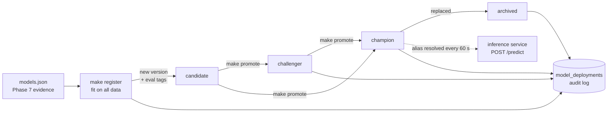

# Model Registry, Promotion and Inference

Phase 8 turns the evaluated model into a served one: training registers it in
MLflow, a person promotes it through audited stages, and a stateless service
serves whatever version is `@champion`.



## Registering a model

`make register` (`stockml.registry.train`):

1. Refuses to run without `data/reports/models.json` containing the held-out
   test section (`make final-test`): no version exists without its evidence.
2. Fits the Phase 7 candidate (XGBoost, tuned parameters) on **all** labelled
   data (2010-03-31 to 2026-09-25, 48,915 rows). GBMs use the same procedure as
   in evaluation: early stopping on the last year. The evaluation numbers
   describe the procedure; the deployed model also learns from the latest data.
3. Logs an MLflow run: parameters, the evaluation metrics, the full
   `models.json` as an artifact, and the model in its native flavor (XGBoost,
   LightGBM or scikit-learn), trimmed to the early-stopped trees.
4. Registers a version with tags: `feature_set_version`, `model_type`,
   `horizon_bars`, training window and row count, dataset revision, git
   commit, and the `eval.*` numbers the gates read.
5. Moves it to `candidate` through the audited promotion path
   (actor `training-pipeline`). It never goes further on its own.

The model's MLflow metadata carries `feature_set_version` and the ordered
`feature_names`; the server uses these, not convention, to build its input.

## Stages, transitions and gates

| From | Allowed to |
| --- | --- |
| (new) | candidate |
| candidate | challenger, champion, archived |
| challenger | champion, archived |
| champion | archived |
| archived | nothing (retrain or re-register instead) |

There is one champion and one challenger at a time: promoting a new one
archives the previous holder in the same step, with its own audit row.

| Gate | Kind | Passes when |
| --- | --- | --- |
| `feature_set_compatible` | hard | the version's `feature_set_version` equals the serving code's (`fs-1.0.0`) |
| `has_evaluation` | soft | the `eval.*` tags from the Phase 7 report are present |
| `beats_base_rate` | soft | log loss improves on the constant base-rate forecast by >= 0.001 on **both** the untuned walk-forward folds (2020-2022) and the 2023+ test |

Hard gates cannot be overridden. Soft gates can, with `--override-gates`; the
override and every gate result are stored in the audit row. Demotion to
`archived` is never gated: taking a model out of service must always work.

The threshold matters for this project. The candidate's log loss is 0.0005
**worse** than the base-rate forecast on the untuned folds and 0.0003 better on
the test set. A plain "lower than the null" check would pass on the test set
alone, on a difference far below the noise. With the threshold, it fails:

```text
$ make promote VERSION=1 TO=champion REASON="..."
promotion.refused  reason='gates failed: beats_base_rate (soft): log loss gain over the
base-rate forecast: walk-forward -0.0005, test +0.0003 (required >= 0.001 on both)'
```

The local deployment was therefore promoted with an explicit override and a
reason that says so. The decision is in [ADR 0006](adr/0006-explicit-audited-promotion.md).

## Audit log

Each transition writes a `model_deployments` row: model, version, from and to
stage, reason, actor (OS user by default), and a JSON snapshot of the gate
results, overridden gates and evaluation tags. The insert runs in a
transaction around the registry change: if MLflow rejects the change, the row
rolls back; if PostgreSQL is down, nothing changes in MLflow. `--audit-file`
writes the same entries to a JSON-lines file for work without the stack.

Example from a local run (registry on SQLite, audit in PostgreSQL 16):

| id | version | from | to | actor | reason |
| --- | --- | --- | --- | --- | --- |
| 1 | 2 | | candidate | training-pipeline | registered by training (xgboost, data to 2026-09-25) |
| 2 | 2 | candidate | champion | root | hot-swap check |
| 3 | 1 | champion | archived | root | replaced by version 2: hot-swap check |

Commands:

```bash
make register                                  # new candidate
make model-status                              # versions, aliases, eval tags
make promote VERSION=2 TO=champion REASON="..." ARGS=--override-gates
make promote VERSION=1 TO=archived REASON="rollback test"
```

## Inference service (`apps/inference`)

| Endpoint | Purpose |
| --- | --- |
| `POST /predict` | Score 1-256 precomputed feature vectors; returns `PredictionEvent` records |
| `GET /model` | Name, version, alias, feature set, horizon, run id, load time |
| `GET /health` | Liveness |
| `GET /ready` | 503 until a compatible model is loaded |
| `GET /metrics` | Requests by outcome, predictions by model version, model-call latency, batch size, served version, load failures |

**Contract.** Requests (`shared.schemas.inference.PredictRequest`) carry
features, not bars: features are computed by the shared `FeatureComputer`
next to the stream state (Phase 9), the same code that built the training
set. Each instance states its `feature_set_version`; the service rejects
(422) a version different from the model's, missing features, non-finite
values and batches over 256. Feature order in the request does not matter;
the service orders columns from the model metadata.

**Response.** One `PredictionEvent` per instance, the same contract as the
`market.predictions` topic: P(up) and P(down), predicted direction, confidence
(the larger probability, explicitly not calibrated certainty), model name and
version, feature set, horizon, target timestamp, and the model-call latency.
`prediction_id` (and `event_id`) are deterministic in (source event, model,
version, horizon), so a redelivered bar produces the same record. Target time
for daily bars counts weekdays (exchange holidays are not modelled).

**Model lifecycle in the service.** A background task resolves the alias
every `INFERENCE_REFRESH_INTERVAL_S` (60 s). A new version is loaded off the
event loop, checked for feature-set compatibility, and swapped in with one
reference assignment; requests in flight finish on the model they started
with. If loading fails or the version is incompatible, the previous model
keeps serving and `sip_inference_model_load_failures_total` increases. With no
model at all, `/ready` and `/predict` return 503 and the rest of the platform
keeps working without predictions. Verified locally: promoting version 2 while
the service ran switched `/model` from version 1 to 2 within the refresh
interval, with no restart.

**Fast path.** MLflow's generic `pyfunc.predict` checks the schema and
converts a DataFrame on every call. For one row that took about 6 ms in a
microbenchmark on this model, against about 0.2 ms for XGBoost's own
`inplace_predict` on a NumPy array. The service already enforces the input
contract, so it calls XGBoost, LightGBM or scikit-learn directly and falls back
to pyfunc for any other flavor. A test checks the fast path returns the same
probabilities as pyfunc for all three model types.

## Measured latency

`scripts/bench_inference.py` (`make bench-inference`) sends requests built
from real dataset rows, **sequentially from one client on the same host**:
latency of an idle service, not throughput under load (that is Phase 12).
2,000 requests per batch size after 50 warm-up requests; XGBoost champion
(version 2, 65 trees); 2 vCPU Intel Xeon @ 2.80 GHz cloud sandbox, Python
3.12, uvicorn single worker. Raw results:
[benchmarks/inference_latency.json](benchmarks/inference_latency.json).

| Batch | HTTP p50 | HTTP p95 | HTTP p99 | Model call p50 | Model call p99 |
| ---: | ---: | ---: | ---: | ---: | ---: |
| 1 | 2.57 ms | 3.92 ms | 4.84 ms | 0.46 ms | 0.90 ms |
| 12 | 5.83 ms | 7.53 ms | 10.07 ms | 0.83 ms | 1.30 ms |
| 64 | 11.62 ms | 16.24 ms | 18.35 ms | 1.01 ms | 1.78 ms |

Most of the round trip is request parsing, validation and response
serialisation, not the model: at batch 64 the model is under 10% of the time.
The single slow outlier per run (max 295 ms at batch 64) was not investigated
and is reported as measured. Numbers on other hardware will differ; rerun the
script rather than reusing these.

## Limitations

* The registry ran on SQLite with a local artifact store for these
  measurements; the Compose stack uses the MLflow server (PostgreSQL backend,
  proxied artifacts). The Docker stack has not been run in this environment.
* No authentication on `/predict` or on promotion beyond database and registry
  access; actor names are self-reported.
* Exchange holidays are not modelled in target timestamps.
* The served model has no demonstrated skill (see [MODELS.md](MODELS.md)).
