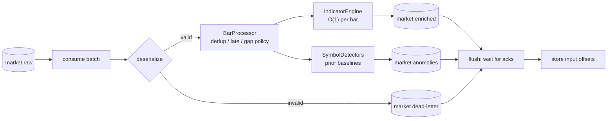

# Stream Processing

`services/stream-processor` consumes `market.raw`, maintains bounded
per-symbol state, and publishes:

- `market.enriched`: every bar plus its technical indicators
- `market.anomalies`: detections with observed value, baseline, score,
  severity, detector name and version
- `market.dead-letter`: anything it cannot decode or process

The computational core (`indicators.py`, `detectors.py`, `processor.py`) is
plain Python with no Kafka dependency, so it is unit-tested directly and
reused by the offline evaluation script.

## 1. Indicators

All indicators are computed **incrementally**: no DataFrame, no
recomputation over history. Each bar costs O(1) work (O(w log w) with w = 60
for the volume median), and memory per symbol is a few fixed-size windows.

| Field | Definition | Warm-up |
| --- | --- | --- |
| `return_1`, `log_return_1`, `price_change` | vs previous close | 2 bars |
| `volume_change_pct` | vs previous volume (`None` if previous was 0) | 2 bars |
| `sma_20`, `bb_middle` | simple mean of 20 closes | 20 |
| `bb_upper`, `bb_lower`, `bb_width` | SMA ± 2 population std; width = (upper - lower) / middle | 20 |
| `ema_12`, `ema_26` | `alpha = 2/(span+1)`, seeded with the first close | 12 / 26 |
| `macd`, `macd_signal`, `macd_hist` | EMA12 − EMA26; EMA9 of MACD; difference | 26 / 34 |
| `rsi_14` | Wilder smoothing seeded with the simple mean of the first 14 moves | 15 |
| `volatility_20` | sample std of the last 20 log returns (per bar, not annualised) | 21 |
| `volume_sma_20`, `volume_ratio` | mean of 20 volumes; volume / mean | 20 |

Values are `None` (never 0) until warmed up. Every indicator is checked in
unit tests against an independent batch implementation (pandas `rolling`,
`ewm(adjust=False)` and a loop-based Wilder RSI) to 1e-9 relative tolerance
or better (1e-6 for Bollinger width).

**Numerical stability.** Rolling mean/std use running sums, which have two
classic failure modes, both tested:

- *Cancellation*: `sum(x²) − n·mean²` loses most significant digits when the
  variance is tiny relative to the level (a $500 stock moving fractions of a
  cent per second). A naive implementation was 0.6% off in the test case; the
  windows keep sums of `x − shift`, where `shift` is a recent mean.
- *Drift*: rounding error accumulates over millions of updates. The sums are
  recomputed exactly from the window every `window` updates (still O(1)
  amortised); after 200,000 updates at a 1e6 offset the error stays below 1e-9.

## 2. Event time, ordering, duplicates and gaps

Indicators are defined over a symbol's bars in **event-time** order
(`timestamp`); `produced_at` (processing time) is only used for latency. Kafka
preserves per-symbol order within a partition, so out-of-order delivery can
only come from producer bugs, replays or multiple producers, and the policy
below makes the outcome deterministic either way:

| Case | Detection | Action |
| --- | --- | --- |
| Duplicate | `event_id` among the symbol's last 256, or same `timestamp` as the last processed bar | dropped; counted as `duplicate` |
| Late / out of order | `timestamp` earlier than the last processed bar | not folded into state, no enriched event; counted as `late`. The raw bar is still persisted by the persistence consumer (Phase 4), so history stays complete; only real-time analytics skip it. Retracting already-published indicators would cost far more than it is worth for a real-time view. |
| Gap | bars missing between the last and current `timestamp` | counted (`sip_stream_missing_bars_total`); indicators continue, no imputation |
| Interval change | symbol switches bar interval | state reset |

Redelivered input therefore never changes results (tested), and outputs carry
**deterministic event ids** (`uuid5` of the raw `event_id`, the output kind and
the detector/indicator version), so downstream consumers can de-duplicate by id.

## 3. Delivery guarantees

Per consumed batch (up to 500 messages):

1. Process every message; invalid ones become dead-letter records.
2. Produce all outputs, then `flush()`: **every** output, including DLQ
   records, must be acknowledged (`acks=all`).
3. Only then store the input offsets (committed in the background).

If any output is not acknowledged the batch is **not** committed and the
process exits non-zero; the restart re-delivers the batch, which is safe
because of the deterministic ids and the duplicate policy above. A poison
message is dead-lettered (with its original bytes, topic, partition and
offset) and its offset committed, so it can never block a partition.
Processing exceptions (bugs) are dead-lettered with reason `processing`.

## 4. State recovery and scaling

Indicator state lives in memory, partitioned like the input: one symbol is
always on one partition, so consumer-group members never share a symbol.

On partition assignment (startup or rebalance) the processor seeks
`STREAM_WARMUP_MESSAGES` (default 2,000) **before** the committed offset and
replays them in warm-up mode: state is rebuilt but nothing is published or
committed until it reaches the committed offset. With 12 symbols over 6
partitions that is ~1,000 bars per symbol, comfortably more than the longest
indicator window (MACD signal, 34 bars). Revoked partitions' symbol state is
dropped after committing.

Trade-offs considered:

| Option | Why not (yet) |
| --- | --- |
| Replay from Kafka (chosen) | no extra infrastructure; restart cost proportional to the warm-up depth |
| Snapshot state to Redis/RocksDB | faster restarts at large scale, but adds a second source of truth that must stay consistent with offsets |
| Kafka Streams / Flink with changelog topics | the "proper" answer at scale (exactly-once state, managed rebalancing); a JVM framework is overkill for this workload and would hide the mechanics this project is meant to show |

Scale out with `docker compose up -d --scale stream-processor=3`; at most 6
members do useful work (6 partitions). Prometheus discovers every replica via
DNS service discovery.

## 5. Anomaly detection

Baselines are built from **prior bars only** and are protected from
contamination: the z-score window stores flagged returns clipped to the
threshold (winsorised), and the volume baseline is a rolling median.

| Detector | Fires when (defaults) | Type |
| --- | --- | --- |
| `return_threshold` | \|1-bar simple return\| > 1% | `price_spike` / `price_drop` |
| `return_zscore` | \|log return − mean\| / std > 5, over the prior 120 returns (≥ 30 required) | `return_zscore` |
| `volume_median` | volume / median of prior 60 volumes > 6 (≥ 20 required) | `volume_spike` |

Severity is the score's multiple of its threshold: < 1.5× low, < 2.5× medium,
< 4× high, else critical. Every anomaly carries `detector_version` (1.0.0).

### Measured detector quality (simulated data)

`make evaluate-detectors` runs the calibrated simulator for all 12 symbols
(20,000 one-second bars each, production anomaly rates) through the real
`BarProcessor` and scores detections against the injected labels. Volume
detections on price-jump bars are not scored, because the simulator
deliberately raises volume on those bars and the ground truth is ambiguous.

Seed 7 (240,000 bars; 235 price jumps, 503 volume spikes injected):

| Detector | TP | FP | FN | Precision | Recall |
| --- | ---: | ---: | ---: | ---: | ---: |
| `return_threshold` | 235 | 0 | 0 | 1.000 | 1.000 |
| `return_zscore` | 235 | 0 | 0 | 1.000 | 1.000 |
| `volume_median` | 405 | 11 | 98 | 0.974 | 0.805 |

Seed 11: `return_threshold` 1.000 / 1.000, `return_zscore` 0.988 / 1.000,
`volume_median` 0.972 / 0.876.

How to read this honestly:

- The price detectors look perfect because the task is easy: an injected jump
  is 2-5% while one-second GBM noise is about 0.02%. Real markets have fat
  tails, volatility clustering and news jumps of every size, where precision
  and recall would be far lower. These numbers validate the implementation,
  not real-world skill.
- Volume misses come from spikes whose multiplier (5-15×) lands under the 6×
  threshold after log-normal noise; false positives are natural volume noise
  above 6× the median. The threshold trades one for the other.
- In the live system the same comparison runs continuously:
  `sip_stream_detector_outcomes_total{detector, outcome}`.

### Throughput of the core

The same run measured **~45 µs per bar** of compute (indicators + detectors +
event construction), i.e. roughly **22,000 bars/s on one core**, in the
2-vCPU build sandbox, excluding Kafka I/O and JSON (de)serialisation.
End-to-end throughput with Kafka is measured in Phase 12.

## 6. Metrics

| Metric | Meaning |
| --- | --- |
| `sip_stream_messages_total{outcome}` | processed / duplicate / late / warmup / invalid / error |
| `sip_stream_dead_lettered_total{reason}` | DLQ records by failure reason |
| `sip_stream_anomalies_total{anomaly_type, severity}` | published anomalies |
| `sip_stream_detector_outcomes_total{detector, outcome}` | tp / fp / fn vs simulator ground truth |
| `sip_stream_end_to_end_latency_seconds` | raw `produced_at` → enriched event built |
| `sip_stream_bar_compute_seconds` | indicator + detector compute per bar |
| `sip_stream_flush_seconds` | waiting for output acks per batch |
| `sip_stream_batch_size` | messages per consumed batch |
| `sip_stream_consumer_lag{topic, partition}` | high watermark − position |
| `sip_stream_missing_bars_total` | gaps in per-symbol sequences |
| `sip_stream_tracked_symbols` | symbols with in-memory state |

Kafka client errors are logged at most once per error code every 30 s, with a
count of suppressed repeats, so an outage is visible without flooding logs.
